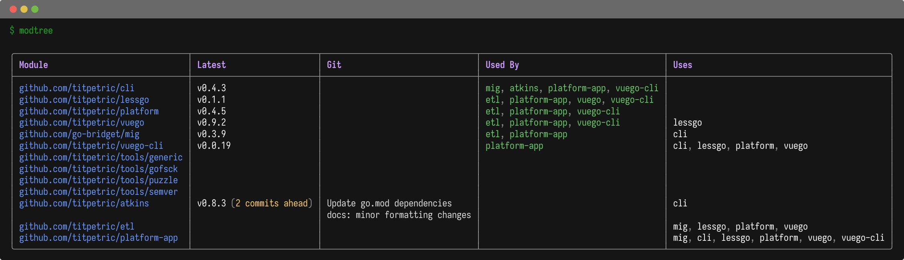

# modtree - Show Go Workspace Tree

This is a simple tool that lists your go workspace as a table. Each
module contained in the workspace is printed with:

- The module name
- The latest git version tagged (+ how many commits ahead)
- Changes in current git source tree (N modified, +/- lines)
- Git history if no local changes and module ahead of tag
- Used by (green = up to date, orange = outdated)
- Uses (how many modules a module uses)

To install the tool:

```bash
go install github.com/titpetric/exp/cmd/modtree@main
```



Run `modtree` or `modtree -u` to update outdated deps between workspace modules.

## Why?

Using a workspace is a relatively smooth experience, but most software
still gets built and delivered outside a workspace. This requires
updating the go.mod dependencies as a new version gets tagged.

For each module in a workspace I'm interested in:

- using the latest release across the workspace in go.mod,
- seeing any local changes not yet commited or pushed,
- updating dependencies in the correct order
